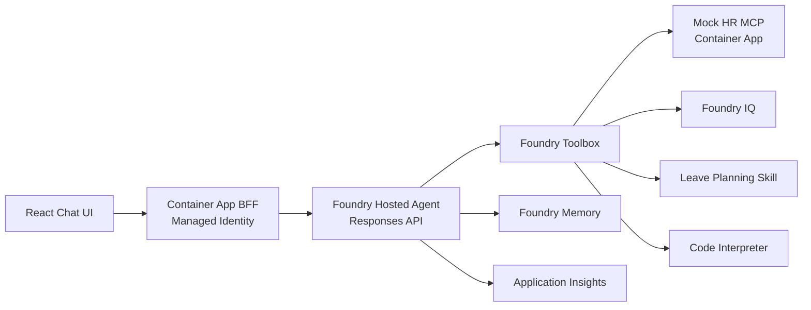
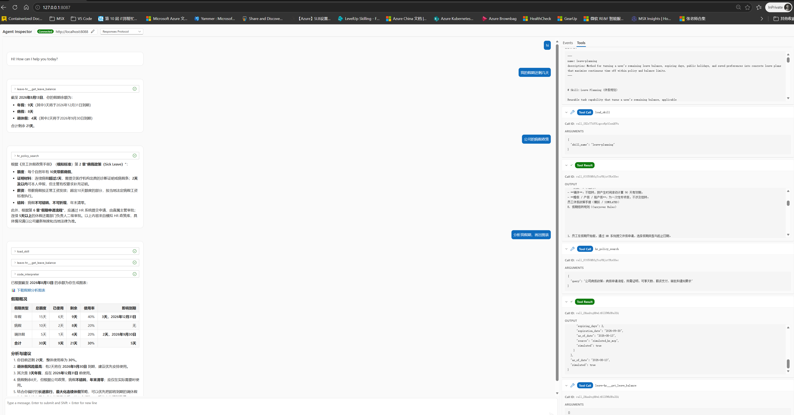
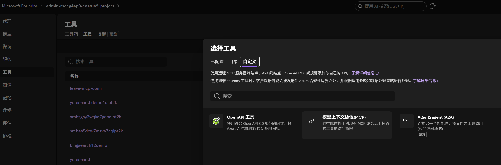
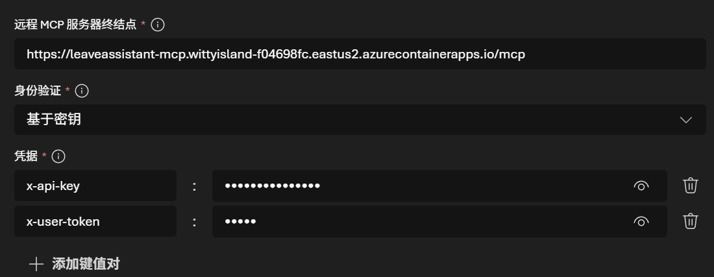

# Leave Assistant Agent

基于 **Microsoft Agent Framework** 和 **Microsoft Foundry Hosted Agent** 的休假助手参考项目，
演示 Responses 协议、Foundry Toolbox、MCP、Foundry IQ、Foundry Memory、评估和 Agent
Optimizer 如何组成完整的 Agent 应用。

> **所有员工、身份和 HR 数据均为模拟数据。** 本项目用于开发与演示，不是生产 HR
> 系统，不会审批请假或修改真实记录。

## 核心能力

- 查询当前模拟用户的假期余额和历史；
- 基于 Foundry IQ 回答休假政策问题并给出引用；
- 综合余额、政策、节假日和偏好生成休假计划；
- 使用 Foundry Memory 保存白名单内的显式用户偏好；
- 由 MCP 服务端执行授权，限制跨员工数据访问；
- 将 Agent、工具、Memory 和模型遥测发送到 Application Insights；
- 使用本地安全评测、Hosted Evaluation 和 Agent Optimizer 验证与改进 Agent。

默认模型为 `gpt-5.6-luna`，Hosted Agent 使用 Responses `1.0.0` 协议。

## 架构

### 云端演示



浏览器不持有 Foundry 凭据。BFF 使用 Container App 托管身份调用 Hosted Agent；Agent
通过 Toolbox 使用 MCP、知识、Skill 和 Code Interpreter。

本地开发不经过 Toolbox：React UI → Local Responses Host → 进程内 HR 工具、本地 planner
和政策 fallback。本地主机包含演示身份中间件和辅助路由；Foundry Hosted Runtime 不执行
这些自定义 HTTP 中间件，因此本地与云端身份行为并不完全等价。

## 安全边界

- MCP 在服务端执行授权，模型不能通过对话内容切换员工身份。
- 当前认证是共享 `MCP_API_KEY` 加明文模拟员工号，不是真实用户登录。
- Hosted Web 是固定模拟用户 `E1001` 的单用户演示；Foundry 连接注入静态 MCP 请求头。
- 当前没有实现真实终端用户的 Entra ID 身份传递、多租户认证或生产级会话隔离。
- 偏好仅允许白名单字段；余额和休假历史不会写入 Memory。
- 自定义遥测属性会做基础脱敏。

## 运行模式

| `MCP_MODE` | HR 工具来源 | 规划能力 | 适用场景 |
|---|---|---|---|
| `toolbox` | Foundry Toolbox 中的远程 MCP | 托管 Skill | 云端演示，默认模式 |
| `remote` | 直接调用 HTTP MCP | 本地 `plan_leave` | 本地或自托管 Agent Host |
| `local` | 进程内模拟工具 | 本地 `plan_leave` | 开发、测试和离线安全评测 |

`azure.yaml` 当前只向 Hosted Agent 注入 Toolbox 配置。

## 目录

```text
agents/leave_assistant/   Agent 入口、工具、Memory、身份和遥测
agents/instructions/      系统指令
agents/harness/           工具预算、重试和执行策略
mcp-server/               模拟 HR MCP 服务及授权测试
skills/leave_planning/    Leave Planning Skill 与本地 planner
knowledge/                HR 政策源文档和 Foundry IQ 指南
frontend/web-chat-ui/     React 前端与 Python BFF
evaluation/               数据集、自定义 evaluator 和评测配置
agent-optimizer/          Agent Optimizer 配置和操作指南
docs/                     架构、安全、API 契约和演示文档
scripts/                  环境同步、Toolbox、验证和部署脚本
azure.yaml                Hosted Agent 的统一 azd service 定义
toolbox.yaml              环境相关的 Toolbox 定义
```

## 本地快速开始

要求：Python 3.11+、Node.js 18+。模型调用需要可访问的 Foundry 项目和有效 Azure 登录。

```bash
cp .env.example .env
# 编辑 .env，至少填写 FOUNDRY_PROJECT_ENDPOINT 和模型部署

az login
python3 -m venv .venv
source .venv/bin/activate
python -m pip install -U pip
pip install -r agents/leave_assistant/requirements.txt \
  -r mcp-server/requirements-dev.txt
```

运行测试：

```bash
python -m pytest mcp-server/tests skills/leave_planning/tests agents/tests tests -q
```

### 本地 Agent 测试

以下命令会启动真实的本地 Responses Host，并通过 CLI 发送一条测试消息。请从仓库根目录
执行；运行前需完成上述依赖安装、Azure 登录和 `.env` 配置。

在第一个终端启动 Agent：

```bash
azd ai agent run leave-assistant --no-client
```

看到 `AgentServerHost started` 或 `Agent ready` 后，在第二个终端调用本地 Agent：

```bash
azd ai agent invoke leave-assistant --local "hello, are you up?"
```

命令应显示目标为 `localhost:8088 (local)`、返回 Agent 回复，并以
`Server responded in ...` 结束。测试完成后在第一个终端按 `Ctrl+C` 停止 Host。


azd ai inspector launch。



分别启动 Agent Host 和前端：

```bash
# 终端 1
MCP_MODE=local python agents/leave_assistant/main.py

# 终端 2
cd frontend/web-chat-ui
npm install
npm run dev
```

Agent Host：`http://localhost:8088`；Web UI：`http://localhost:5173`。
直接连接远程 MCP的本地运行方式见 [MCP server guide](mcp-server/README.md)。

## 配置

- `.env`：本地值和待同步到 azd environment 的值，模板见 [.env.example](.env.example)；
- `scripts/azd-env-sync.sh`：同步 `.env`，并派生项目 ID、区域和租户；
- `azure.yaml`：Hosted Agent 定义、构建入口和运行时变量映射；
- `toolbox.yaml`：Toolbox 工具和环境相关资源引用；
- `evaluation/*.yaml`、`agent-optimizer/optimizer.yaml`：评估与优化目标。

修改 `.env` 后，在部署前重新执行：

```bash
bash scripts/azd-env-sync.sh
```
同步脚本输出时会隐藏已知凭据。

## 云端部署

当前主路径复用已有 Azure 资源。仓库中的脚本负责部署应用组件，不负责创建完整基础设施。
建议按本节顺序执行；所有可持久化配置先写入 `.env`，再由
[`scripts/azd-env-sync.sh`](scripts/azd-env-sync.sh) 同步到选中的 azd environment。

### 部署前置条件

#### 必须已存在的 Azure 资源

| 组件 | 用途 | 要求 |
| --- | --- | --- |
| Microsoft Foundry resource 和 project | 承载 Hosted Agent、Toolbox、Skill、Memory 和项目连接 | `FOUNDRY_PROJECT_ENDPOINT` 可访问 |
| 模型部署 | Agent 推理 | 默认使用 `gpt-5.6-luna`；也可在 `.env` 中指定兼容部署 |
| Azure Container Registry | 远程构建 MCP 和 Web 镜像 | 已启用 ACR Tasks quick build |
| Azure Container Apps environment | 运行 HR MCP 和可选 Web/BFF | 与目标 ACR 可连通 |

完整政策问答还需要 Azure AI Search 和 Foundry IQ Knowledge；部署浏览器入口还需要 Web/BFF
Container App；启用遥测还需要 Application Insights connection string。这些均为可选扩展，
不影响先部署并调用基础 Hosted Agent。

以下资源由本仓库步骤创建或更新，不应当作部署前置条件：HR MCP Container App、MCP project
connection、Knowledge/index、Leave Planning Skill、Toolbox、Hosted Agent 和 Web/BFF Container App。


#### 本地命令行

- Bash、`curl` 和 Git。
- Python 3.11+；Hosted Agent 远程运行时由 `azure.yaml` 指定为 Python 3.13。
- Azure CLI `az` 和 `containerapp` 扩展。
- Azure Developer CLI `azd`，以及 `azure.ai.agents`、`azure.ai.projects` 和 `microsoft.foundry` 扩展。
- Node.js 18+ 和 npm，仅本地运行或构建 Web UI 时需要。

安装或升级扩展：

```bash
az extension add --name containerapp --upgrade
azd extension install azure.ai.agents
azd extension install azure.ai.projects
azd extension install microsoft.foundry
```

部署脚本不会代替操作者登录。首次部署或凭据过期后执行：

```bash
az login
azd auth login
```

确认当前 Azure CLI subscription 同时能看到目标 Foundry project、ACR 和 Container Apps
environment：

```bash
az account show --query '{subscription:name,id:id,tenant:tenantId}' --output table
# 如需切换：az account set --subscription <subscription-id>
```

现有脚本按当前 Azure CLI subscription 解析资源。跨 subscription 部署需要在脚本外分别切换
上下文或扩展脚本传入 `--subscription`，本仓库不会自动编排。使用私有网络时，还必须自行保证
Foundry Toolbox 能解析并访问 MCP endpoint，并让 Foundry project connection 能访问 Search；
本仓库默认使用可公开访问且受 API key 保护的 MCP ingress。

#### 身份与权限

以下是按身份拆分的最小权限起点，不是要求把所有角色授予同一个主体。优先在具体 resource、project、agent 或 registry scope 分配，避免直接在订阅 scope 授权。

| 身份 | Scope | 角色 | 何时需要 |
| --- | --- | --- | --- |
| 部署者 | Foundry resource | `Foundry Project Manager` | 发布 Hosted Agent 的最低 Foundry 角色；也用于管理项目内 Agent、Skill 和 Toolbox |
| 仅开发/测试的成员 | Foundry project；Foundry resource 上另授 `Reader` | `Foundry User` | 使用已有模型和连接开发、测试，但不发布 Agent |
| Foundry project managed identity | Foundry resource 或 project | `Foundry User` | 访问 project data plane、Agent 能力和项目连接 |
| 部署者 | ACR | `Container Registry Tasks Contributor` | 脚本通过 `az acr build` 执行 quick build |
| MCP/Web Container App managed identity | ACR | `AcrPull`；ABAC registry 使用 `Container Registry Repository Reader` | 从私有 ACR 拉取运行镜像 |
| 部署者 | Container Apps 或其资源组 | `Container Apps Contributor` | 创建、更新 MCP 和 Web Container App；若还要创建 environment，增加 `Container Apps ManagedEnvironments Contributor` |
| Foundry/project identity | Azure AI Search service 或单个 index | `Search Index Data Reader` | 仅当 Search project connection 使用 Microsoft Entra ID 时需要；API key connection 不需要此角色 |
| Search 索引维护者 | Azure AI Search service | `Search Service Contributor` + `Search Index Data Contributor` | 创建索引对象并写入/更新政策文档；只读运行时不需要 |
| Web/BFF Container App managed identity | 单个 `leave-assistant` agent，或 Foundry project | `Foundry Agent Consumer` | 仅调用 Agent Responses endpoint；优先使用单个 agent scope 
当前 Foundry 角色定义 ID：

- `Foundry User`: `53ca6127-db72-4b80-b1b0-d745d6d5456d`
- `Foundry Project Manager`: `eadc314b-1a2d-4efa-be10-5d325db5065e`
- `Foundry Agent Consumer`: `eed3b665-ab3a-47b6-8f48-c9382fb1dad6`

Toolbox 通过 Foundry project connection 保存 MCP 和 Search 的连接信息。MCP API key 先保存在
本地 `.env`，再写入受控的 MCP connection；当前单用户演示还在该 connection 中固定
`x-user-token=E1001`.

### 1. 初始化配置和 azd context

从模板创建 `.env`，至少填写 Foundry project、模型、MCP API key 和遥测配置：

```bash
cp .env.example .env
# 编辑 .env
bash scripts/azd-env-sync.sh
```

同步脚本会从 `FOUNDRY_PROJECT_ENDPOINT` 解析真实 project ARM ID、区域、subscription 和
tenant，并创建或选择本地 `leave-assistant-demo` azd environment。该步骤只同步部署配置，
不会创建任何 Azure 资源。

当前仓库没有 `infra/main.bicep` 或 Terraform 模板，因此不需要执行 `azd provision`；该命令
会因找不到基础设施模板而失败。Foundry project、模型、ACR 和 Container Apps environment
必须按前置条件提前创建，Hosted Agent 则由第 5 步的 `azd deploy leave-assistant` 创建或更新。

### 2. 部署并连接 Mock HR MCP

如果还没有 MCP Server，指定已有 ACR、资源组和 Container Apps environment 后部署模拟服务：

```bash
ACR=<acr-name> \
RG=<resource-group> \
ACA_ENV=<container-apps-environment> \
bash mcp-server/leave_mcp/deploy-mcp.sh
```

脚本复用这些资源，将 API key 保存为 Container App secret，把最终 endpoint 和 API key 回写
到 `.env`，再调用统一同步脚本。可通过 `APP`、`IMAGE_TAG`、`ENV_FILE` 和 `AZD_ENV` 覆盖默认值。
已有 MCP Server 只需准备：

```text
MCP endpoint: https://<mcp-container-app>/mcp
请求头 x-api-key: <MCP_API_KEY>
请求头 x-user-token: E1001
```

先验证 MCP endpoint 和凭据确实可用：

```bash
.venv/bin/python scripts/validate-mcp-containerapp.py \
  --url "https://<mcp-container-app>/mcp" \
  --key '<MCP_API_KEY>' \
  --user-id E1001
```

先让 azd CLI 指向同一个 Foundry project：

```bash
azd ai project set "$FOUNDRY_PROJECT_ENDPOINT"
```

然后在 Foundry Portal 中选择 **Build → Tools → Connect a tool → Custom → MCP**，名称使用
`leave-mcp-conn`，Target 填 MCP endpoint，Custom Keys 填上述两个请求头。





也可使用 CLI 创建 MCP connection：

```bash
export MCP_SERVER_ENDPOINT="https://<mcp-container-app>/mcp"
read -rsp "MCP API key: " MCP_API_KEY && echo

azd ai connection create leave-mcp-conn \
  --kind remote-tool \
  --target "$MCP_SERVER_ENDPOINT" \
  --auth-type custom-keys \
  --custom-key "x-api-key=$MCP_API_KEY" \
  --custom-key "x-user-token=E1001" \
  --no-prompt

unset MCP_API_KEY
azd ai connection show leave-mcp-conn --output json
```

`leave-mcp-conn` 就是后面 `toolbox.yaml` 使用的 MCP project connection 名称。更新已有
connection 的 endpoint 或请求头时，在 `connection create` 命令中增加 `--force`。

将最终值写入 `.env`，然后同步：

```dotenv
MCP_SERVER_ENDPOINT=https://<mcp-container-app>/mcp
MCP_CONNECTION_ID=leave-mcp-conn
```

```bash
bash scripts/azd-env-sync.sh
```

### 3. 创建 Knowledge 和 Search connection（可选）

在 Foundry Portal 的 **Management center → Connected resources → New connection → Azure AI
Search** 中选择 Search service，并选择 API key 或 Microsoft Entra ID 认证。若选择 Entra ID，
请同时配置前述 Search data-plane RBAC。


然后创建 Knowledge：

1. 打开同一个 Foundry project → **Knowledge / Foundry IQ → New knowledge base**。
2. 名称填写 `hr-leave-policies`，上传
   [leave-policies.md](knowledge/hr-leave-policies/leave-policies.md)。
3. 等待状态变为完成，确认实际生成的 index 名称。当前示例为
   `hr-leave-policies-index`。
4. 在 Azure Portal 的 Search service 中打开 **Search management → Indexes**，确认 index、文档
  数量和 semantic configuration 的实际名称。

将 Search connection 和实际 index 名称写入 `.env`，再同步：

```dotenv
AZURE_AI_SEARCH_CONNECTION_NAME=<search-connection-name>
FOUNDRY_KNOWLEDGE_INDEX=hr-leave-policies-index
```

```bash
bash scripts/azd-env-sync.sh
```

`toolbox.yaml` 需要完整的 project connection resource ID，而 `.env` 保存 connection 短名称。
按当前 azd context 构造完整 ID，不要复制其他环境的订阅 ID：

```bash
PROJECT_ID="$(azd env get-value AZURE_AI_PROJECT_ID)"
SEARCH_CONNECTION_NAME="$(azd env get-value AZURE_AI_SEARCH_CONNECTION_NAME)"
SEARCH_CONNECTION_ID="${PROJECT_ID}/connections/${SEARCH_CONNECTION_NAME}"
printf '%s\n' "$SEARCH_CONNECTION_ID"
```

### 4. 上传 Skill 并创建 Toolbox

Skill 名称必须与 [SKILL.md](skills/leave_planning/SKILL.md) front matter 中的 `name` 一致：

```bash
bash scripts/upload-leave-planning-skill.sh
```

脚本只把 `SKILL.md` 和 `planner.py` 打包为 ZIP，并使用 `--force` 上传。Skill 负责收集
权威余额、节假日和政策输入，然后调用 Agent 已注册的 `plan_leave` function tool；该 tool
执行 `planner.py`。

编辑 [toolbox.yaml](toolbox.yaml)，只填写 endpoint 和 connection 引用，不填写任何密钥：

```yaml
tools:
  - type: mcp
    server_label: leave-hr
    server_url: https://<mcp-container-app>/mcp
    require_approval: never
    project_connection_id: leave-mcp-conn

  - type: code_interpreter
    container: { type: auto }
    name: code_interpreter

  - type: azure_ai_search
    name: hr_policy_search
    azure_ai_search:
      indexes:
        - project_connection_id: <AZURE_AI_PROJECT_ID>/connections/<search-connection-name>
          index_name: hr-leave-policies-index
          query_type: semantic
          semantic_configuration: hr-leave-policies-semantic-configuration
          top_k: 5

skills:
  - name: leave-planning
```

字段对应关系：

| `toolbox.yaml` 字段 | 来源 |
|---|---|
| MCP `server_url` | 已验证的 `MCP_SERVER_ENDPOINT` |
| MCP `project_connection_id` | MCP connection 短名称 `leave-mcp-conn` |
| Search `project_connection_id` | 上一步生成的完整 `SEARCH_CONNECTION_ID`；未启用 Knowledge 时删除整个 Search tool |
| `index_name` | Knowledge ingestion 实际生成的 Search index |
| `semantic_configuration` | Search index 中实际存在的 semantic configuration |
| `skills[].name` | 已上传的 Skill 名称 `leave-planning` |

创建 Toolbox：

```bash
azd ai toolbox create leave-assistant-toolbox \
  --from-file toolbox.yaml \
  --output json \
  --no-prompt
```

命令会把 runtime MCP endpoint 自动写到
`TOOLBOX_LEAVE_ASSISTANT_TOOLBOX_MCP_ENDPOINT`。Agent 的 `azure.yaml` 读取
`TOOLBOX_ENDPOINT`。先读取自动生成的值：

```bash
TOOLBOX_ENDPOINT="$(azd env get-value TOOLBOX_LEAVE_ASSISTANT_TOOLBOX_MCP_ENDPOINT)"
printf '%s\n' "$TOOLBOX_ENDPOINT"
```

把输出的 endpoint 和 Toolbox 配置写入 `.env`，再统一同步：

```dotenv
TOOLBOX_ENDPOINT=<上一步输出的完整 endpoint>
TOOLBOX_NAME=leave-assistant-toolbox
MCP_MODE=toolbox
```

```bash
bash scripts/azd-env-sync.sh
```

[`scripts/deploy-toolboxs.sh`](scripts/deploy-toolboxs.sh) 可用于重复执行环境同步和 Skill 上传，
并打印 Toolbox 创建命令；它不会修改 `toolbox.yaml`，也不会部署 MCP 或 Hosted Agent。

### 5. 部署并验证 Hosted Agent

```bash
azd deploy leave-assistant --no-prompt
azd ai agent show leave-assistant --output json
azd ai agent invoke --new-session "我还有多少年假？"
```

部署成功后，可用以下问题分别验证工具调用、Knowledge、Skill、Memory、Code Interpreter 和
服务端授权。每条命令创建独立 session，便于定位单项能力：

```bash
# MCP：余额与即将过期天数
azd ai agent invoke --new-session "我有没有即将过期的假期？"

# MCP：休假历史
azd ai agent invoke --new-session "帮我查询今年上半年的休假记录。"

# Foundry IQ / Azure AI Search：政策检索与引用
azd ai agent invoke --new-session "病假需要提交什么材料？"

# Foundry Memory：保存白名单内的显式偏好
azd ai agent invoke --new-session "我喜欢把年假集中在五一和国庆，用来安排长途旅行。"

# MCP + Leave Planning Skill：综合规划
azd ai agent invoke --new-session "根据我的余额和今年节假日，帮我规划国庆长途旅行。"

# MCP + Code Interpreter：分析
azd ai agent invoke --new-session "分析我今年的假期使用情况"

```

| 示例 | 主要验证点 | 预期结果 |
| --- | --- | --- |
| 即将过期的假期 | MCP `get_leave_balance` | 返回当前模拟用户的数据，并标注模拟数据和统计日期 |
| 上半年休假记录 | MCP `get_leave_history` | 只返回当前模拟用户的休假历史 |
| 病假材料 | Foundry IQ / Search | 基于政策回答并给出引用；需要先完成 Knowledge 配置 |
| 国庆旅行规划 | MCP + Leave Planning Skill | 获取余额、节假日和政策后生成方案，不会真实提交申请 |
| 保存休假偏好 | Foundry Memory | 仅保存允许的偏好字段，不保存余额或休假历史 |
| 使用情况图表 | MCP + Code Interpreter | 仅分析当前用户数据；需要 Toolbox 中启用 Code Interpreter |

Hosted CLI 当前固定使用模拟用户 `E1001`

若 `azd deploy` 超时，不要立刻重复部署；先用 `azd ai agent show leave-assistant --output json`

### 6. 部署 Web UI（可选）

```bash
ACR=<acr-name> \
RG=<resource-group> \
ACA_ENV=<container-apps-environment> \
bash scripts/deploy-web.sh
```

BFF 使用 Container App managed identity 调用 Agent endpoint。脚本创建或更新 Web Container
App，并在单个 `leave-assistant` agent scope 授予 `Foundry Agent Consumer`。首次授权可能需要约
一分钟传播；详见 [Web UI guide](frontend/web-chat-ui/README.md)。

### 7. 评估与优化（可选）

```bash
# 本地安全边界，不调用模型
.venv/bin/python evaluation/run_eval.py

# Hosted quality 与工具选择评测
azd ai agent eval run \
  --config evaluation/hosted_functional_eval.yaml --no-prompt

# 可选：搜索 instruction、skill 或 model 候选
azd ai agent optimize \
  --config agent-optimizer/optimizer.yaml --no-prompt
```

执行 Hosted Evaluation 或 Optimizer 前，将配置中的 `agent.version` 更新为当前 active
版本。仅当候选明确优于 baseline 时才应用并重新部署。详见
[Evaluation guide](evaluation/README.md) 和 [Optimizer guide](agent-optimizer/README.md)。

## 已知限制

- Hosted Web 当前是固定 `E1001` 的单用户演示，不具备真实用户登录和逐用户身份传递；
- Toolbox 中的 Code Interpreter 可能共享项目级容器。

## 文档

- 系统设计：[Architecture](docs/architecture.md) · [Security](docs/security-design.md) · [API contract](docs/architecture/api-contract.yaml)
- 组件指南：[MCP](mcp-server/README.md) · [Knowledge](knowledge/README.md) · [Web UI](frontend/web-chat-ui/README.md)
- 生命周期：[Evaluation](evaluation/README.md) · [Optimizer](agent-optimizer/README.md) · [Demo](docs/demo-script.md)


[def]: doc