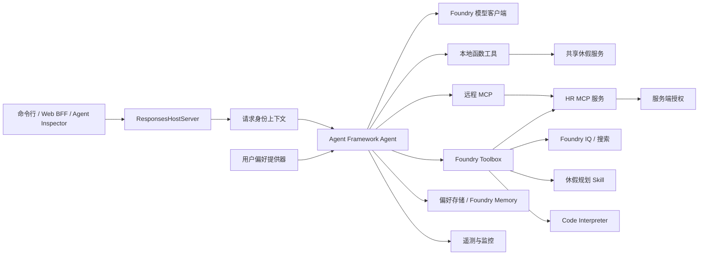
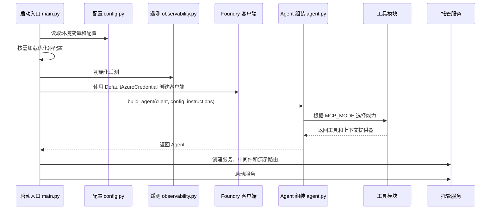
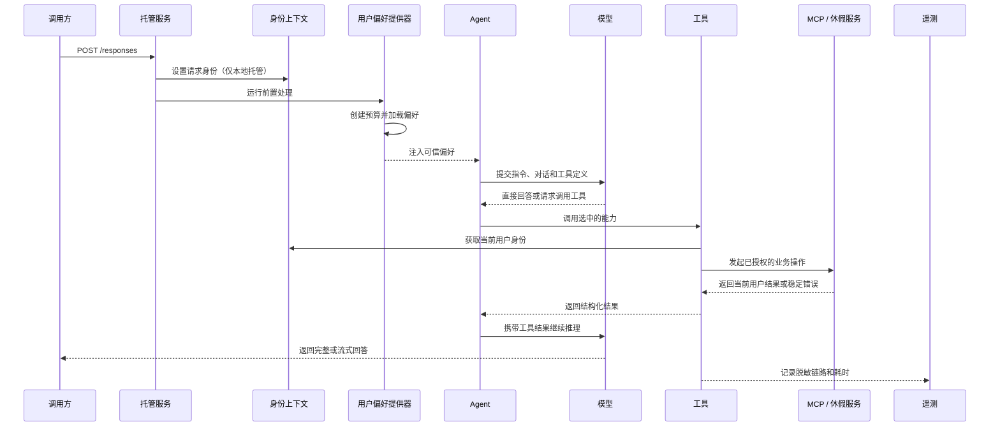

# 使用 Harness 构建 Agent

本目录包含一套可复用的执行策略层，以及一个完整的 Microsoft Agent Framework 示例 Agent。
你可以参考它构建自己的 Agent，并让模型、工具、身份边界、运行限制和托管入口保持解耦，便于
独立测试。

示例中的所有 HR 身份和业务数据均为模拟数据。

## 目录结构

```text
agents/
├── harness/             与框架无关的运行限制、重试和人工审批策略
├── instructions/        可版本化的系统指令
├── prompts/             共享提示词片段
├── leave_assistant/     Agent Framework + Foundry 完整示例
└── tests/               Harness 和 Agent 组装测试
```

Harness 本身不是 Agent，也不是服务器。它提供一组执行策略基础能力，由 Agent 在生命周期钩子
和工具包装器中主动调用：

| 模块 | 职责 |
| --- | --- |
| [`harness/config.py`](harness/config.py) | 定义 `HarnessConfig`、工具和步骤上限、可重试错误以及写工具清单 |
| [`harness/hooks.py`](harness/hooks.py) | 实现 `RunBudget` 计数器和 `HarnessLimitExceeded` 异常 |
| [`harness/runtime.py`](harness/runtime.py) | 管理每次请求的预算上下文、工具和步骤计数以及重试辅助函数 |
| [`leave_assistant/agent.py`](leave_assistant/agent.py) | 展示如何使用 `build_agent()` 组装 Agent |
| [`leave_assistant/main.py`](leave_assistant/main.py) | 展示如何创建 Foundry 客户端和 `ResponsesHostServer` 入口 |

## 快速理解 Leave Assistant

Leave Assistant 是基于 Microsoft Agent Framework、通过 OpenAI Responses 协议托管的
Agent。模型负责选择已注册的能力，身份识别和 HR 授权始终在模型之外执行。所有 HR 数据均为
模拟数据。



核心对象是 `build_agent()` 返回的 `Agent`，其周围组件各自只负责一个边界：

- `main.py`：进程启动和托管；
- `agent.py`：能力组装；
- 工具模块：模型可见的 schema 和服务调用；
- `identity.py`：请求级调用者身份；
- MCP/service：服务端授权；
- Context Provider：注入每次运行所需的可信上下文；
- Store：只持久化必要状态；
- Harness：执行策略；
- Observability：负责遥测和敏感信息脱敏。

## 启动流程

进程从 [`leave_assistant/main.py`](leave_assistant/main.py) 启动：



启动步骤：

1. `load_dotenv()` 读取本地环境变量；托管环境变量由 `azure.yaml` 注入。
2. `load_config()` 将环境变量转换为不可变的 `Config`。
3. Agent Optimizer 配置可在实验时替换模型或系统指令。
4. `DefaultAzureCredential` 负责向 Foundry 项目认证。
5. `build_agent()` 根据 `MCP_MODE` 选择工具和上下文提供器。
6. `ResponsesHostServer` 通过 Responses 协议公开 Agent。
7. 仅本地运行时加载身份中间件和辅助路由，用于模拟用户切换和保存会话指针；Foundry 托管
   运行时不会执行这些自定义路由。

## 单次请求流程

每个请求依次经过：



关键边界：

- 模型永远不能选择员工身份。本地请求从中间件取得身份；托管单用户演示的进程内规划和偏好
    工具回退到 `DEMO_DEFAULT_USER`。
- 直接连接远程 MCP 时会转发请求级模拟身份；当前 Toolbox 演示则在 MCP 项目连接中固定保存
    `x-user-token=E1001`，因此只适合单用户演示。
- HR MCP 独立校验 API key 和模拟用户请求头，并在服务端重新授权每次调用。
- `UserPreferenceProvider.before_run()` 为每次运行创建独立的 Harness 预算，只注入当前用户的
    白名单偏好。
- Responses Store 保存对话历史；`session_store.py` 只保存轻量的用户级响应指针，不保存对话
    正文或 HR 业务数据。

## 组件职责

### Agent 包

| 组件 | 调用方 | 作用 |
| --- | --- | --- |
| [`leave_assistant/main.py`](leave_assistant/main.py) | Python/Hosted Agent 入口 | 加载配置、优化器设置和遥测；创建凭据、客户端、Agent 与 Responses 托管服务 |
| [`leave_assistant/config.py`](leave_assistant/config.py) | `main.py` | 从环境变量读取 endpoint、模型、模式、限制、Memory 和遥测配置 |
| [`leave_assistant/agent.py`](leave_assistant/agent.py) | `main.py` | `build_agent()` 选择能力并构造 Agent，不负责创建凭据或服务器 |
| [`instructions/leave_assistant.md`](instructions/leave_assistant.md) | `Config.instructions` | 定义行为、工具调用规则、安全约束和回答风格 |
| [`leave_assistant/identity.py`](leave_assistant/identity.py) | 中间件和工具 | 在 `ContextVar` 中保存请求身份，并解析已验证的模拟 principal |
| [`leave_assistant/local_tools.py`](leave_assistant/local_tools.py) | 本地模式 Agent；其他模式的共享本地能力 | 定义函数工具结构、人工审批、工具预算、重试、规划、偏好和本地回退方案 |
| [`leave_assistant/remote_tools.py`](leave_assistant/remote_tools.py) | `MCP_MODE=remote` 时的 `build_agent()` | 使用请求级请求头直连 HTTP MCP，并注册本地规划与偏好工具 |
| [`leave_assistant/toolbox_tools.py`](leave_assistant/toolbox_tools.py) | `MCP_MODE=toolbox` 时的 `build_agent()` | 连接 Foundry Toolbox 并将 Toolbox Skill 作为上下文；当前 HR MCP 连接固定为 `E1001` |
| [`leave_assistant/memory.py`](leave_assistant/memory.py) | Agent Framework 每次运行前 | 启动运行预算，并将保存的用户偏好作为可信上下文注入 |
| [`leave_assistant/preference_store.py`](leave_assistant/preference_store.py) | 偏好工具和上下文提供器 | 只保存白名单偏好；配置时使用 Foundry Memory，否则回退到文件存储 |
| [`leave_assistant/session_store.py`](leave_assistant/session_store.py) | 本地 `/session/state` 路由 | 每个用户只保存 `previous_response_id` 和对话指针 |
| [`leave_assistant/knowledge_local.py`](leave_assistant/knowledge_local.py) | 本地政策工具 | 提供带章节引用的离线政策检索 |
| [`leave_assistant/analysis.py`](leave_assistant/analysis.py) | 分析工具 | 将余额和历史转换为图表数据，不依赖 Agent Framework |
| [`leave_assistant/observability.py`](leave_assistant/observability.py) | 入口和工具包装器 | 配置 Application Insights，并记录已脱敏的 span、状态和延迟 |
| [`leave_assistant/__init__.py`](leave_assistant/__init__.py) | 包导入 | 让本地模式可导入共享 MCP 服务和 Leave Planning Skill |

### 共享策略与外部组件

| 组件 | 作用 |
| --- | --- |
| [`harness/config.py`](harness/config.py) | 声明步骤和工具限制、瞬时错误重试策略、写工具和上下文压缩保留信号 |
| [`harness/hooks.py`](harness/hooks.py) | 实现 `RunBudget` 计数器和超限异常 |
| [`harness/runtime.py`](harness/runtime.py) | 在 `ContextVar` 中保存请求预算，提供计数和重试辅助函数 |
| [`../mcp-server/leave_mcp/service.py`](../mcp-server/leave_mcp/service.py) | 共享业务服务，也是最终可信的服务端授权边界 |
| [`../skills/leave_planning/planner.py`](../skills/leave_planning/planner.py) | `plan_leave` function tool 使用的确定性休假规划算法 |
| Foundry Toolbox | 通过一个终结点统一治理并公开 HR MCP、Foundry IQ、Skill 和 Code Interpreter |
| Foundry Responses Store | `RESPONSES_STORE=true` 时持久化托管对话轮次 |
| Foundry Memory store | 由 `FOUNDRY_MEMORY_STORE` 选择的可选持久偏好后端 |

## 工具模式

`build_agent()` 只选择一条 HR 工具路径；规划和偏好能力在需要时仍由本地 Python 函数
提供。

| 模式 | HR 数据路径 | 政策知识 | 规划 | 适用场景 |
| --- | --- | --- | --- | --- |
| `MCP_MODE=local` | 函数工具 → 进程内共享休假服务 | `knowledge_local.py` | 本地 `plan_leave` → 确定性规划器 | 单元测试、离线开发、本地演示 |
| `MCP_MODE=remote` | Agent Framework MCP 工具 → HTTP MCP 服务 | 可用时使用 Foundry 知识检索，并保留本地回退方案 | 本地 `plan_leave` | 不使用 Toolbox 的直接 MCP 集成 |
| `MCP_MODE=toolbox` | `FoundryToolbox` → Toolbox → HR MCP | Toolbox 内的 Foundry IQ/Search | Toolbox Skill 编排本地 `plan_leave` | 托管云端演示和受治理的工具发现 |

三种模式下，HR 授权都属于共享 service/MCP 边界，Toolbox 和模型都不是授权主体。

## 典型调用

### 余额查询

问题：“我还有多少年假？”

1. 模型从已注册的 HR 能力中选择 `get_leave_balance`。
2. 本地模式下，`_run()` 通过 `current_principal()` 取得当前身份，记录工具调用次数，然后调用
   共享休假服务。
3. 远程 MCP 模式会转发请求身份；当前 Toolbox 连接固定使用 `E1001`。HR MCP 校验 API key，
   并确认该用户有权访问目标数据。
4. 工具返回结构化余额，模型将其整理为自然语言，并明确说明这是模拟数据。

### 政策问答

问题：“病假需要提交什么材料？”

1. 本地模式调用 `search_leave_policy`，从仓库中的政策文档检索匹配章节。
2. Toolbox 模式使用受治理的 Foundry IQ/Azure AI Search。
3. 检索到的文本只作为参考数据，绝不会被当作可执行指令。
4. 最终回答会引用政策章节；如果现有政策无法确认，则明确说明无法确认。

### 休假规划

问题：“根据我的余额和节假日，帮我规划国庆长途旅行。”

1. Agent 先取得可信的余额和法定节假日数据。
2. `UserPreferenceProvider` 提供用户之前保存的规划偏好。
3. Toolbox 模式下，由 Leave Planning Skill 控制规划流程。
4. Agent 调用 `plan_leave`，由确定性规划器完成日期和天数计算。
5. 模型负责解释规划结果，不会自行重新计算，也不会提交真实休假申请。

## 五分钟快速上手

在仓库根目录执行：

```bash
python3 -m venv .venv
.venv/bin/python -m pip install -r agents/leave_assistant/requirements.txt \
  -r mcp-server/requirements-dev.txt

cp .env.example .env
# 编辑 .env，设置 FOUNDRY_PROJECT_ENDPOINT 和已部署的模型名称。
az login

# 本地模式使用进程内模拟 HR 服务和本地政策检索。
MCP_MODE=local .venv/bin/python agents/leave_assistant/main.py
```

在另一个终端调用本地 Responses host：

```bash
curl -N http://localhost:8088/responses \
  -H 'Content-Type: application/json' \
  -H 'x-user-token: E1001' \
  -d '{"input":"我还有多少年假？","store":true}'
```

修改 Agent 组装前先运行聚焦测试：

```bash
.venv/bin/python -m pytest agents/tests -q
```

需要 Foundry 托管时，配置 `.env`，在仓库根目录同步后部署并调用：

```bash
bash scripts/azd-env-sync.sh
azd deploy leave-assistant --no-prompt
azd ai agent invoke --new-session "我还有多少年假？"
```

仓库没有基础设施模板，因此不要执行 `azd provision`。

## 构建新的 Agent 包

下面以 `agents/travel_assistant/` 为例。你可以替换 Agent 名称和业务工具，但必须继续把身份识别
和授权放在模型之外。

### 第 1 步：创建包结构

```text
agents/travel_assistant/
├── __init__.py
├── agent.py              组装 Agent 对象
├── config.py             读取环境配置
├── context.py            初始化每次运行并注入可信上下文
├── main.py               创建客户端和托管服务
└── tools.py              定义工具、授权、预算和重试
```

将系统指令放在 `agents/instructions/travel_assistant.md`，将测试放在 `agents/tests/`。
密钥和服务终结点必须通过环境变量提供，不要写入 Python 模块或提示词。

### 第 2 步：定义应用配置和 Harness 策略

应用配置和 Harness 策略是两类不同的配置。先从环境变量读取部署参数，再显式构造传给
`start_run()` 和工具包装器的执行策略：

```python
from dataclasses import dataclass
import os

from agents.harness.config import HarnessConfig, RetryPolicy


@dataclass(frozen=True)
class Config:
    project_endpoint: str
    model_deployment: str
    harness: HarnessConfig


def load_config() -> Config:
    return Config(
        project_endpoint=os.environ["FOUNDRY_PROJECT_ENDPOINT"],
        model_deployment=os.environ.get(
            "AZURE_AI_MODEL_DEPLOYMENT_NAME", "gpt-5.6-luna"
        ),
        harness=HarnessConfig(
            max_steps=int(os.environ.get("AGENT_MAX_STEPS", "12")),
            max_tool_calls=int(os.environ.get("AGENT_MAX_TOOL_CALLS", "20")),
            retry=RetryPolicy(
                max_attempts=2,
                backoff_seconds=1.0,
                retryable_error_codes=("SERVICE_UNAVAILABLE",),
            ),
        ),
    )
```

身份认证、权限校验、参数校验和策略错误都不应重试。只有幂等操作，或带有幂等键的操作，才能
安全重试。

### 第 3 步：为每次请求创建独立预算

使用 Agent Framework 的 `ContextProvider` 初始化请求级 Harness 状态。运行时会将当前
`RunBudget` 保存到 `ContextVar`，从而避免并发请求共用计数器：

```python
from agent_framework import ContextProvider

from agents.harness.runtime import start_run


class HarnessContextProvider(ContextProvider):
    def __init__(self, harness_config):
        super().__init__("harness")
        self._harness_config = harness_config

    async def before_run(self, *, agent, session, context, state, **kwargs):
        start_run(self._harness_config)
```

工具执行前必须解析已验证的身份，并且只注入可信上下文。不要让提示词、工具参数或模型输出决定
调用者身份。`leave_assistant/memory.py` 中的 `UserPreferenceProvider.before_run()` 展示了
如何初始化每次运行并注入用户私有偏好。

### 第 4 步：包装本地工具

所有需要纳入预算的本地工具都必须调用 `note_tool_call()`。仅对明确的瞬时服务错误使用
`should_retry_sleep()`：

```python
from agent_framework import tool

from agents.harness.runtime import (
    HarnessLimitExceeded,
    note_tool_call,
    should_retry_sleep,
)


def _run_tool(name, call, harness_config):
    try:
        note_tool_call(name)
    except HarnessLimitExceeded as exc:
        return {"error": {"code": "TOOL_BUDGET_EXCEEDED", "message": str(exc)}}

    attempt = 0
    while True:
        try:
            return call()
        except ServiceError as exc:
            if should_retry_sleep(exc.code, attempt, harness_config):
                attempt += 1
                continue
            return {"error": {"code": exc.code, "message": str(exc)}}


@tool(approval_mode="never_require", description="Read the current user's trips.")
def get_my_trips() -> dict:
    principal = current_principal()
    return _run_tool(
        "get_my_trips",
        lambda: trip_service.get_my_trips(principal),
        CONFIG.harness,
    )
```

上例中的 `ServiceError`、`current_principal`、`trip_service` 和 `CONFIG` 属于新应用，需要在
服务层、身份层和配置层中自行实现。服务端必须重新授权每次操作，不能信任模型或客户端传入的
权限结论。

### 第 5 步：写操作必须经过人工审批

`HarnessConfig.write_tools` 用于记录需要审查的写工具清单，真正的人工审批由工具声明中的
Agent Framework 配置强制执行：

```python
@tool(
    approval_mode="always_require",
    description="预览预订内容。未经明确批准，不执行实际写入。",
)
def create_booking_preview(...) -> dict:
    ...
```

工具装饰器必须和 `write_tools` 清单保持一致。预览工具不能直接修改数据；只有托管服务收到明确
批准，并且业务服务重新检查权限和当前状态后，才能执行真实写入。

### 第 6 步：组装 Agent

让组装函数不依赖具体客户端实现，以便测试时传入模拟客户端：

```python
from agent_framework import Agent

from .context import HarnessContextProvider
from .tools import TOOLS


def build_agent(client, config, instructions: str) -> Agent:
    return Agent(
        client=client,
        name="travel-assistant",
        instructions=instructions,
        tools=list(TOOLS),
        context_providers=[HarnessContextProvider(config.harness)],
        default_options={"store": True},
    )
```

不要在 `build_agent()` 中创建凭据、网络客户端或服务器。示例 `leave_assistant/agent.py` 会先
选择本地工具、远程 MCP 或 Toolbox 工具，然后再构造唯一的 `Agent` 对象。

### 第 7 步：添加 Foundry Responses 托管入口

入口文件负责加载环境变量、创建凭据、初始化遥测、创建客户端并管理托管服务生命周期：

```python
from agent_framework.foundry import FoundryChatClient
from agent_framework_foundry_hosting import ResponsesHostServer
from azure.identity import DefaultAzureCredential
from dotenv import load_dotenv
from pathlib import Path

from .agent import build_agent
from .config import load_config


def load_instructions() -> str:
    path = Path(__file__).resolve().parents[1] / "instructions" / "travel_assistant.md"
    return path.read_text(encoding="utf-8")


def main() -> None:
    load_dotenv()
    config = load_config()
    client = FoundryChatClient(
        project_endpoint=config.project_endpoint,
        model=config.model_deployment,
        credential=DefaultAzureCredential(),
    )
    agent = build_agent(client, config, instructions=load_instructions())
    ResponsesHostServer(agent).run()


if __name__ == "__main__":
    main()
```

接入生产流量前必须添加真实的身份认证中间件。不要将示例 Agent 的模拟身份中间件复制到生产
环境。

### 第 8 步：测试策略和 Agent 组装

至少覆盖以下场景：

- 步骤数或工具调用数超限时抛出 `HarnessLimitExceeded`；
- 瞬时错误只重试到配置的次数上限；
- 权限和参数校验错误绝不重试；
- 每个写工具都使用 `approval_mode="always_require"`；
- `build_agent()` 注册了预期的工具和上下文提供器；
- 并发请求分别使用独立的预算和身份；
- 服务层拒绝跨用户访问。

在仓库根目录运行 Harness 和 Agent 测试：

```bash
.venv/bin/python -m pytest agents/tests -q
```

可参考现有测试：[`tests/test_harness.py`](tests/test_harness.py)、
[`tests/test_harness_runtime.py`](tests/test_harness_runtime.py) 和
[`tests/test_optimizer_integration.py`](tests/test_optimizer_integration.py)。

### 第 9 步：本地运行并部署

安装示例 Agent 使用的 Agent Framework 依赖：

```bash
.venv/bin/python -m pip install -r agents/leave_assistant/requirements.txt
FOUNDRY_PROJECT_ENDPOINT="https://<account>.services.ai.azure.com/api/projects/<project>" \
AZURE_AI_MODEL_DEPLOYMENT_NAME="<model-deployment>" \
.venv/bin/python -m agents.travel_assistant.main
```

在仓库根目录的 `azure.yaml` 中添加新服务。映射 Agent 运行时读取的每个配置值，并将
`entryPoint` 指向它的 `main.py`：

```yaml
services:
  travel-assistant:
    host: azure.ai.agent
    kind: hosted
    name: travel-assistant
    protocols:
      - protocol: responses
        version: 1.0.0
    language: python
    project: .
    codeConfiguration:
      dependencyResolution: remote_build
      entryPoint: agents/travel_assistant/main.py
      runtime: python_3_13
    env:
      AGENT_MAX_STEPS: ${AGENT_MAX_STEPS}
      AGENT_MAX_TOOL_CALLS: ${AGENT_MAX_TOOL_CALLS}
      AZURE_AI_MODEL_DEPLOYMENT_NAME: ${AZURE_AI_MODEL_DEPLOYMENT_NAME}
      FOUNDRY_PROJECT_ENDPOINT: ${FOUNDRY_PROJECT_ENDPOINT}
```

同步当前选择的 azd 环境，并只部署新服务：

```bash
bash scripts/azd-env-sync.sh
azd deploy travel-assistant --no-prompt
azd ai agent invoke --new-session "你能帮我做什么？"
```

本仓库没有基础设施模板，因此不要执行 `azd provision`。部署 Agent 前，需要先创建 Foundry
项目并完成模型部署。

## 当前实现边界

在判断某项限制是否覆盖全部模式前，请先了解以下边界：

- `note_tool_call()` 只对显式调用它的工具生效。示例中的本地工具包装器已接入；远程 MCP 和
    Toolbox 调用目前不会经过该包装器。
- `note_step()` 和步骤计数器已经存在，但当前 Leave Assistant 尚未将 `note_step()` 接入
    Agent Framework 生命周期钩子。因此，在完成接入前，步骤上限只是策略声明，不会被实际强制。
- `should_retry_sleep()` 只用于示例中的本地服务包装器。除非添加等效中间件，否则远程 MCP
    和 Toolbox 会遵循各自 SDK 的重试行为。
- `ContextVar` 可以隔离异步请求之间的预算状态，但每个托管入口仍必须在每次请求开始时调用
    `start_run()`。
- `HarnessConfig.write_tools` 用来记录人工审批策略；工具装饰器中的
    `approval_mode="always_require"` 才负责强制执行审批。

如果要完整理解代码调用顺序，建议依次阅读
[`leave_assistant/main.py`](leave_assistant/main.py)、
[`leave_assistant/agent.py`](leave_assistant/agent.py)、
[`leave_assistant/memory.py`](leave_assistant/memory.py) 和
[`leave_assistant/local_tools.py`](leave_assistant/local_tools.py)。
