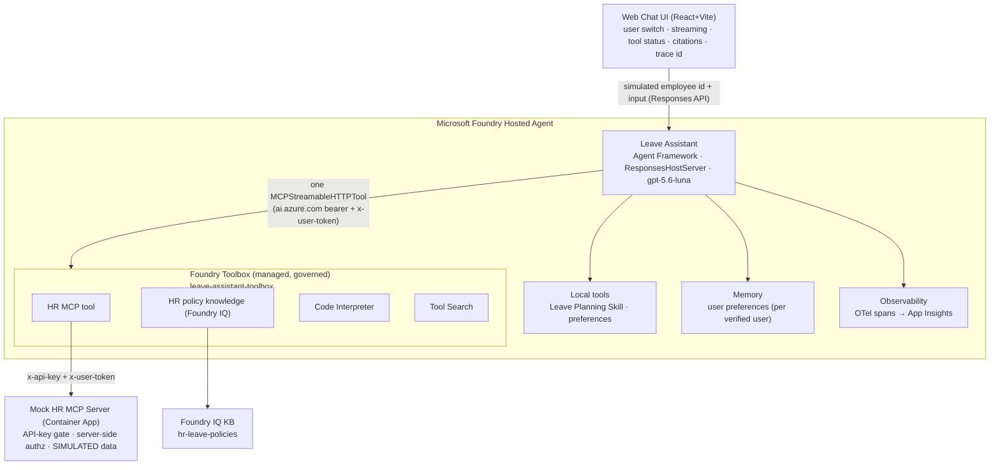
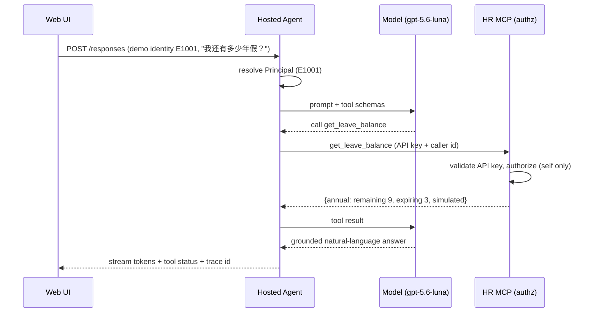

# Architecture — Leave Assistant Demo

> All HR data is **SIMULATED**. This is a Microsoft Foundry reference demo, not a
> production HR system.

## Component overview

## Request flow (balance query)

## Key decisions
- **Three tool-wiring modes** (`MCP_MODE`):
  - **`toolbox`** (default) — the agent connects to ONE governed **Foundry Toolbox**
    MCP endpoint (`{project}/toolboxes/leave-assistant-toolbox/mcp?api-version=v1`)
    and discovers all curated tools (HR MCP on Container App, Tool Search, Code
    Interpreter, HR-policy knowledge). Tool credentials live in Foundry connections;
    versions are promoted without agent code changes. Built by `scripts/create_toolbox.py`.
  - **`remote`** — direct `client.get_mcp_tool` to the Container App MCP server
    (`x-api-key` authentication plus `x-user-token` simulated identity).
  - **`local`** — in-process mock service (used by tests/eval only).
  All three share the exact same `leave_mcp.service` authorization code, so the
  security boundary is identical.
- **Authorization is server-enforced.** In `toolbox` mode the platform bearer
  (`ai.azure.com`) is on `Authorization`, the Foundry connection supplies the MCP
  API key, and the simulated employee id is forwarded on `x-user-token`. The MCP
  accepts that id only after validating the key. Model/tool-argument employee ids
  are never trusted. Production end-user identity requires a real IdP.
- **Memory stores preferences only.** Business data (balances/history) is fetched
  fresh each time and never persisted as memory.
- **Skills + Toolbox + MCP** are complementary: the managed Toolbox governs
  discoverable capabilities, the Skill (`leave-planning`) encapsulates the planning
  method, and MCP is the standardized interface to the (mock) HR system. In toolbox
  mode the **Leave Planning skill is governed by the Toolbox** (uploaded via
  `azd ai skill create`, referenced in `toolbox.yaml`) and delivered to the model via
  progressive disclosure (`FoundryToolbox(...).as_skills_provider()` in
  `toolbox_tools.build_toolbox_capabilities`); the executable `plan_leave` tool does the math.

## Code map
| Area | Path |
|------|------|
| Hosted agent | `agents/leave_assistant/` (`main.py`, `agent.py`, `toolbox_tools.py`, `remote_tools.py`, `local_tools.py`) |
| Toolbox build | `scripts/create_toolbox.py` |
| Identity | `agents/leave_assistant/identity.py`, `mcp-server/leave_mcp/auth.py` |
| Memory | `agents/leave_assistant/preference_store.py`, `memory.py` |
| Observability | `agents/leave_assistant/observability.py` |
| Harness policy | `agents/harness/` |
| Skill | `skills/leave_planning/` |
| MCP server | `mcp-server/leave_mcp/` |
| Knowledge | `knowledge/hr-leave-policies/` |
| Frontend | `frontend/web-chat-ui/` |
| Evaluation | `evaluation/` |
| Contract | `docs/architecture/api-contract.yaml` |
