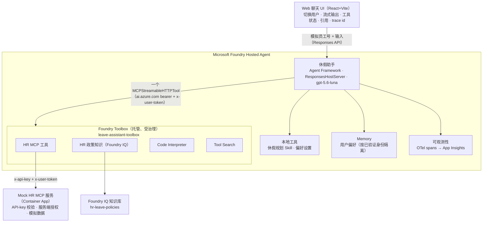
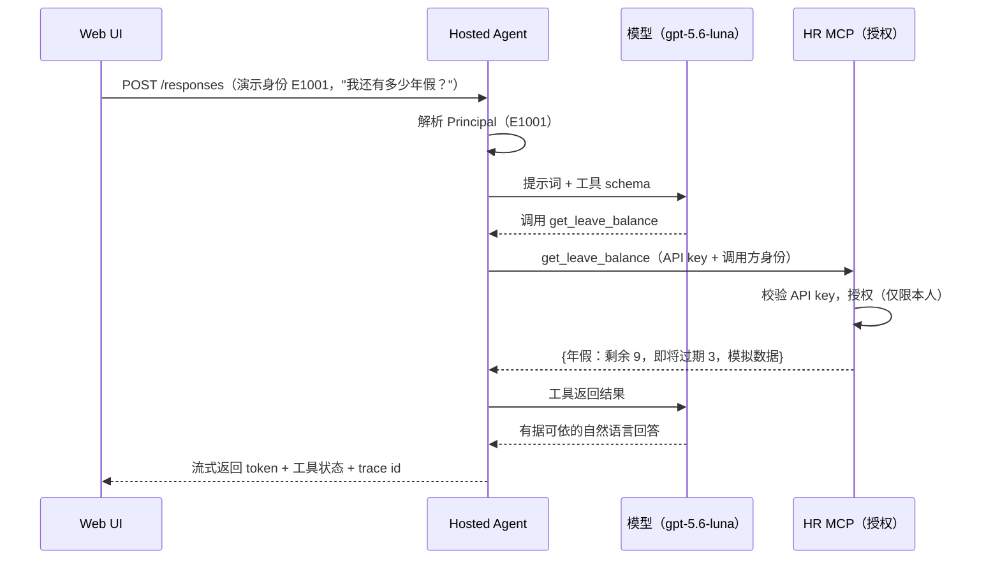

# 架构设计 — 休假助手 Demo

> 所有 HR 数据均为**模拟数据**。这是一个 Microsoft Foundry 参考 Demo，不是
> 生产级 HR 系统。

## 组件总览

## 请求流程（查询余额）

## 关键设计决策
- **三种工具接入模式**（`MCP_MODE`）：
  - **`toolbox`**（默认）——Agent 连接到一个受治理的 **Foundry Toolbox**
    MCP 端点（`{project}/toolboxes/leave-assistant-toolbox/mcp?api-version=v1`），
    自动发现所有精选工具（Container App 上的 HR MCP、Tool Search、Code
    Interpreter、HR 政策知识）。工具凭据保存在 Foundry 连接中；升级工具版本
    无需改动 Agent 代码。由 `scripts/create_toolbox.py` 构建。
  - **`remote`**——直接用 `client.get_mcp_tool` 调用 Container App 上的 MCP 服务
    （`x-api-key` 认证，`x-user-token` 携带模拟身份）。
  - **`local`**——进程内的 mock 服务（仅供测试/评估使用）。
  三种模式共用完全相同的 `leave_mcp.service` 授权代码，因此安全边界完全一致。
- **授权由服务端强制执行。** 在 `toolbox` 模式下，平台 bearer
  （`ai.azure.com`）放在 `Authorization` 头，Foundry 连接提供 MCP
  API key，模拟员工号通过 `x-user-token` 转发。MCP 只有在校验 key 通过后才接受该
  身份。模型或工具参数里的员工号一律不被信任。生产环境的真实终端用户身份需要接入
  真实的 IdP。
- **Memory 只存偏好。** 业务数据（余额/历史）每次都实时拉取，绝不作为 Memory 持久化。
- **Skill + Toolbox + MCP** 三者互补：托管的 Toolbox 治理可被发现的能力，Skill
  （`leave-planning`）封装规划方法，MCP 则是访问（模拟）HR 系统的标准化接口。在
  toolbox 模式下，**休假规划 Skill 由 Toolbox 治理**（通过 `azd ai skill create`
  上传，在 `toolbox.yaml` 中引用），并以渐进式披露的方式交付给模型
  （`toolbox_tools.build_toolbox_capabilities` 中的
  `FoundryToolbox(...).as_skills_provider()`）；实际计算由可执行工具 `plan_leave` 完成。

## 代码索引
| 模块 | 路径 |
|------|------|
| Hosted Agent | `agents/leave_assistant/`（`main.py`、`agent.py`、`toolbox_tools.py`、`remote_tools.py`、`local_tools.py`） |
| Toolbox 构建 | `scripts/create_toolbox.py` |
| 身份 | `agents/leave_assistant/identity.py`、`mcp-server/leave_mcp/auth.py` |
| Memory | `agents/leave_assistant/preference_store.py`、`memory.py` |
| 可观测性 | `agents/leave_assistant/observability.py` |
| Harness 策略 | `agents/harness/` |
| Skill | `skills/leave_planning/` |
| MCP 服务 | `mcp-server/leave_mcp/` |
| 知识库 | `knowledge/hr-leave-policies/` |
| 前端 | `frontend/web-chat-ui/` |
| 评估 | `evaluation/` |
| 接口契约 | `docs/architecture/api-contract.yaml` |
